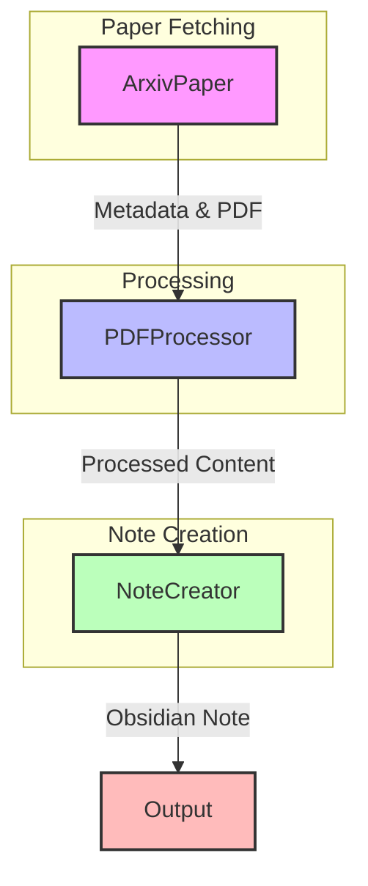

# arXiv to Obsidian Converter
This is **not obsidian-plugin**. Inspired by [arxiv-assistant](https://github.com/Puer-Hyun/arxiv-assistant).

Automatically converts arXiv papers into well-formatted Obsidian notes. It downloads papers using arXiv IDs, processes their content, and creates structured notes with metadata, summaries, and key points.

⬇️ Sample Output ⬇️



## ✨ Features

- Downloads papers directly from arXiv using paper IDs
- Extracts citation counts from Semantic Scholar
- Processes PDF content with OCR support
- Handles two-column academic paper layouts
- Creates well-structured Obsidian notes with:
    - Paper metadata
    - Citation information
    - Research field categorization
    - Key points section
    - Personal notes template
    - Formatted content with proper paragraph breaks


## ➕ Prerequisites

- Python 3.12 or higher
- Tesseract OCR
- Poppler Utils
- Poetry (optional)
- Docker (optional)

## 🚩 Installation
### Option 1: Standard Python Setup

Clone the repository

bashCopygit clone https://github.com/yourusername/arxiv-to-obsidian.git
cd arxiv-to-obsidian

Install system dependencies

``` bash
# Ubuntu/Debian
sudo apt-get update
sudo apt-get install tesseract-ocr poppler-utils

# macOS
brew install tesseract poppler
Install Python dependencies
bashCopypip install -r requirements.txt
```

### Option 2: Using Poetry

Install Poetry

```bash
curl -sSL https://install.python-poetry.org | python3 -
```

Install dependencies

```bash
poetry install
```

### Option 3: Using Docker
```bash
docker-compose up --build
```

## 🚀 Usage
Basic Usage
bashCopy# Using Python directly
python main.py 2304.08485

# Using Poetry
poetry run arxiv-to-obsidian 2304.08485

# Using Docker
```
docker run -v $(pwd)/output:/app/output arxiv-to-obsidian 2304.08485
```
Output Directory can be customized :
```bash
python main.py 2304.08485 --output /path/to/output
```

```
📁 Project Structure
Copyarxiv_to_obsidian/
├── requirements.txt
├── README.md
├── scripts/
│   ├── __init__.py
│   ├── arxiv_fetcher.py     # arXiv paper functionality
│   ├── pdf_processor.py     # PDF processing
│   └── note_creator.py      # Obsidian note creation
├── main.py                  # Main execution file
└── tests/                   # Test files
    └── __init__.py
```